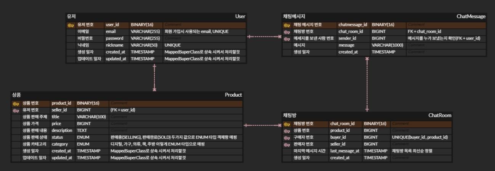
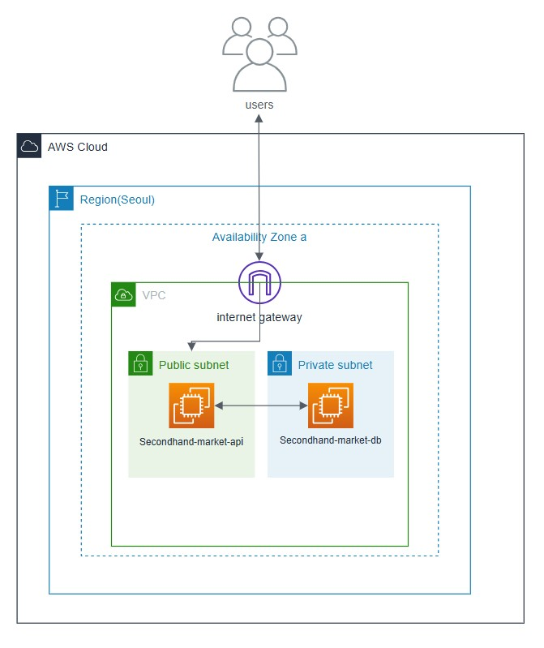

# ⛺ 중고 거래 서비스 API 

---
당근마켓과 같은 중고 거래 서비스를 위한 API 입니다!

🍥프로젝트 기능 및 설계
--- 
---
+ [중고 거래 기능]
1. 상품 등록/조회/관리
2. 상품 등록 기능
   + 제목/ 가격/ 설명/ 카테고리
3. 상품 목록 조회 기능
   + 최신순/가격순 정렬
4. 상품 수정 기능
   + 작성자 본인만 가능하게 설정
5. 상품 삭제 기능
   + 작성자 본인만 가능하게 설정
6. 상품 검색 및 상태 
7. 상품명 기반 검색 기능
8. 상품 거래 상태 변경
   + 판매중 / 거래완료
   
+ [채팅 기능]
1. 채팅방 관리
2. 채팅방 생성 기능
   + 특정 상품 & 구매자 기준 채팅방 생성
   +    판매자와 구매자간 1대1 채팅
3. 채팅방 목록 조회 기능
   + 채팅창의 마지막 수정 시간별 목록 조회 
4. 채팅 메시지
5. 채팅 메시지 전송 기능
6. 채팅 메시지 목록 조회 기능

+  [회원 기능] 
1. 인증
2. 회원 가입 
3. 로그인
4. JWT 발급
5. 로그아웃 처리
6. 인가
7. 로그인 사용자만 접근 가능한 API 분리
8. 본인 리소스만 수정/삭제 가능

🆔ERD
---

중고 거래 서비스의 핵심 도메인을 기준으로  
회원, 상품, 채팅방, 채팅 메시지 엔티티를 중심으로 설계했습니다.

- 상품과 구매자 기준으로 채팅방이 생성됩니다.
- 동일 상품에 대해 동일 구매자는 하나의 채팅방만 생성할 수 있습니다.

♦️ AWS 아키텍처 다이어그램
---
---

🛠 기술 스택
---
---
- **Java** 21
- **Spring Boot** 3.5.8
- Spring Web(REST API)
- Spring Data JPA(Hibernate)
- Spring Security
- Spring WebSocket(STOMP)
- JWT
- QueryDSL
- MySQL 
- Gradle
- Docker
- AWS(VPC, EC2)

📦 이미지 저장소 (Supabase Storage) 선택 근거
---
---
배포 대상인 Render 무료 티어는 컨테이너 디스크가 휘발성이라, 서버 로컬에 업로드 파일을 두면 재배포·재시작 시 사라진다. 따라서 상품 이미지는 외부 오브젝트 스토리지에 저장해야 한다.

여러 후보(AWS S3, Cloudflare R2, 자체 호스팅 MinIO) 중 **Supabase Storage**를 택한 이유:
- 무료 티어에서 S3 호환 오브젝트 스토리지를 제공하고, **REST API만으로 업로드**가 가능해 무거운 벤더 SDK 의존성 없이 Spring `RestClient`만으로 연동된다(신규 의존성 0).
- 프로덕션 DB(PostgreSQL)를 Supabase로 통합하면 스토리지·DB 벤더를 하나로 관리할 수 있어 운영 포인트가 준다.

**벤더 종속을 피하기 위해** 애플리케이션은 `ImageStorage` 인터페이스에만 의존하고, Supabase는 그 구현체 하나(`SupabaseImageStorage`)로 격리했다. S3·R2 등으로 교체할 때 구현체만 추가하면 되고 서비스/컨트롤러/엔티티/테스트는 바뀌지 않는다.

**접근 정책**: 상품 사진은 본질적으로 로그인 없이 노출되는 공개 콘텐츠이므로, 버킷은 **공개 읽기(public read)**로 두어 안정적 URL·CDN 캐싱 이점을 취한다. 대신 열거(enumeration)를 막기 위해 **① 객체 키를 추측 불가능한 UUID로 생성**하고 **② 객체 목록 조회(LIST)를 비활성화**한다(익명 키에 storage LIST 권한을 부여하지 않음). 쓰기는 서버가 보유한 **service_role 키로만** 수행하며, 접속 정보(URL/Service Key)는 `.env`로만 주입한다(코드·저장소에 시크릿 미포함). 신분증·비공개 문서처럼 접근 제어가 필요한 파일이 생기면 그때 해당 용도의 버킷만 private + 서명 URL로 분리한다.

🔧Trouble Shooting
---
---
https://github.com/SebinBae/secondhand-market-backend/blob/main/docs/TROUBLE_SHOOTING.md
