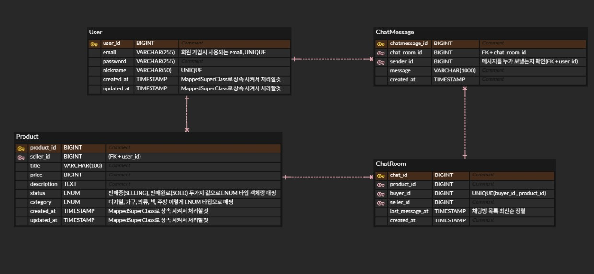

# ⛺ 중고 거래 서비스 API 

---
당근마켓과 같은 중고 거래 서비스를 위한 API 입니다!

🍥프로젝트 기능 및 설계
--- 
---
+ [중고 거래 기능]
1. 상품 등록/조회/관리
2. 상품 등록 기능
   + 제목/ 가격/ 설명/ 카테고리
3. 상품 목록 조회 기능
   + 최신순/가격순 정렬
4. 상품 수정 기능
   + 작성자 본인만 가능하게 설정
5. 상품 삭제 기능
   + 작성자 본인만 가능하게 설정
6. 상품 검색 및 상태 
7. 상품명 기반 검색 기능
8. 상품 거래 상태 변경
   + 판매중 / 거래완료
   
+ [채팅 기능]
1. 채팅방 관리
2. 채팅방 생성 기능
   + 특정 상품 & 구매자 기준 채팅방 생성
   +    판매자와 구매자간 1대1 채팅
3. 채팅방 목록 조회 기능
   + 채팅창의 마지막 수정 시간별 목록 조회 
4. 채팅 메시지
5. 채팅 메시지 전송 기능
6. 채팅 메시지 목록 조회 기능

+  [회원 기능] 
1. 인증
2. 회원 가입 
3. 로그인
4. JWT 발급
5. 로그아웃 처리
6. 인가
7. 로그인 사용자만 접근 가능한 API 분리
8. 본인 리소스만 수정/삭제 가능

🆔ERD
---

중고 거래 서비스의 핵심 도메인을 기준으로  
회원, 상품, 채팅방, 채팅 메시지 엔티티를 중심으로 설계했습니다.

- 상품과 구매자 기준으로 채팅방이 생성됩니다.
- 동일 상품에 대해 동일 구매자는 하나의 채팅방만 생성할 수 있습니다.

🛠 기술 스택
---
---
- **Java** 21
- **Spring Boot** 3.5.8
- Spring Web(REST API)
- Spring Data JPA(Hibernate)
- Spring Security
- Spring WebSocket(STOMP)
- JWT
- QueryDSL
- MySQL 
- Gradle

🔧Trouble Shooting
---
---
https://github.com/SebinBae/secondhand-market-backend/blob/main/docs/TROUBLE_SHOOTING.md